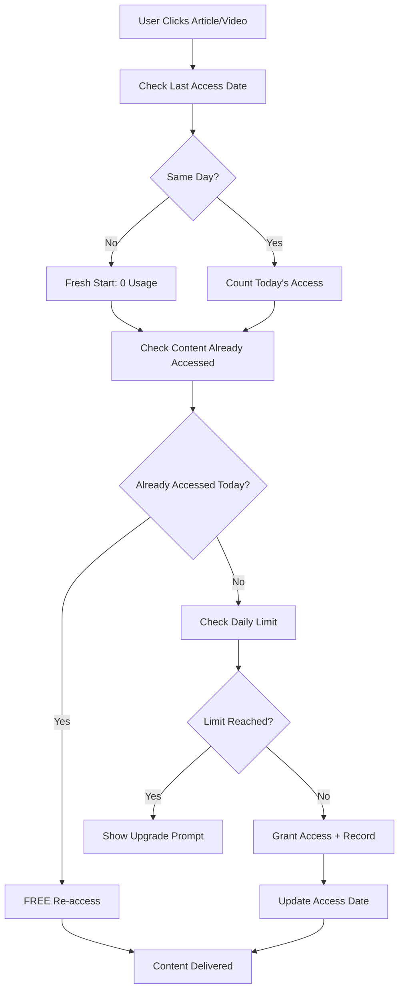

# Social Media Platform - TypeScript Monorepo

A comprehensive social media platform built with TypeScript, featuring a React frontend, Express backend, and MongoDB database. The platform includes **revolutionary date-based daily content access limits**, social authentication, and content management capabilities.

## 🎉 **CURRENT STATUS: FULLY OPERATIONAL WITH ADVANCED DAILY TRACKING**

✅ **Development Environment Ready**
- Backend API running on port 5001
- Frontend React app running on port 3000  
- MongoDB and Redis containers running
- **🗓️ Date-based daily limits system operational**
- **⚡ Real-time usage tracking and smart re-access**
- Authentication system configured
- Tailwind CSS styling working
- All TypeScript compilation errors resolved
- **📚 Interactive Swagger API Documentation active**

## 🏗️ Architecture

### Monorepo Structure
```
astronacci-assesment/
├── apps/
│   ├── frontend/          # React TypeScript frontend
│   └── backend/           # Express TypeScript backend
├── packages/
│   └── shared/           # Shared types and utilities
├── scripts/              # Database and deployment scripts
├── docker-compose.yml    # Docker orchestration
└── package.json         # Workspace configuration
```

### Technology Stack

#### Frontend
- **React 18** with TypeScript
- **Tailwind CSS v3** for styling
- **React Router** for navigation
- **Axios** for API communication
- **Context API** for state management

#### Backend
- **Express.js** with TypeScript
- **MongoDB** with Mongoose ODM
- **Passport.js** for OAuth (Google/Facebook)
- **JWT** for authentication
- **bcrypt** for password hashing

#### Shared
- **TypeScript** for type safety
- **Shared types** and utilities
- **ESLint** for code quality

## 🚀 Quick Start

### Prerequisites
- Node.js 18+
- npm or yarn
- MongoDB (local or cloud)
- Docker (optional)

### Installation

1. **Clone the repository**
```bash
git clone <repository-url>
cd astronacci-assesment
```

2. **Install dependencies**
```bash
npm install
```

3. **Environment Setup**
```bash
# Backend environment
cp apps/backend/.env.example apps/backend/.env

# Frontend environment (create manually)
echo "REACT_APP_API_URL=http://localhost:5001/api" > apps/frontend/.env
```

4. **Start Database Services**
```bash
# Start MongoDB and Redis with Docker
docker compose up -d mongodb redis
```

5. **Start Development Servers**
```bash
# Start both frontend and backend
npm run dev

# Or start individually
npm run dev:frontend    # Frontend on http://localhost:3000
npm run dev:backend     # Backend on http://localhost:5001
```

**🚀 Your application will be available at:**
- Frontend: http://localhost:3000
- Backend API: http://localhost:5001
- Health Check: http://localhost:5001/health
- **📚 Interactive API Documentation: http://localhost:5001/api-docs**

4. **Configure OAuth (Optional)**
   - Create Google OAuth credentials
   - Create Facebook App credentials
   - Update environment variables

5. **Start development servers**
```bash
# Start all services
npm run dev

# Or start individually
npm run dev:frontend    # Frontend only
npm run dev:backend     # Backend only
npm run dev:shared      # Shared package
```

### Using Docker

1. **Start with Docker Compose**
```bash
docker-compose up -d
```

2. **View logs**
```bash
docker-compose logs -f
```

3. **Stop services**
```bash
docker-compose down
```

## 👥 Daily Content Access System

### 🔄 **New Daily Limits Implementation**

The platform now uses a **daily content access system** instead of monthly limits. This provides a better user experience by allowing users to see all available content while managing access to detailed views.

### Membership Tiers & Daily Limits

| Tier | Daily Articles | Daily Videos | Features | Price |
|------|---------------|--------------|----------|-------|
| **Type A** | 3 | 3 | Basic daily access, Free | Free |
| **Type B** | 10 | 10 | Enhanced daily access | $9.99/month |
| **Type C** | Unlimited | Unlimited | All features, unlimited access | $19.99/month |

### 🎯 **How Daily Limits Work**

#### **Content Discovery (Unlimited)**
- ✅ **All users can browse all content** in listing pages
- ✅ **Full visibility** of articles and videos
- ✅ **Search and filter** through all available content
- ✅ **See titles, excerpts, and metadata** for all content

#### **Content Access (Daily Limited)**
- 📖 **Article Detail Pages**: Count against daily article limit
- 🎥 **Video Detail Pages**: Count against daily video limit
- 🔄 **Smart Re-access**: Revisiting content accessed earlier today is **FREE**
- 🌙 **Daily Reset**: Limits reset automatically at midnight

#### **Key Features**
1. **📅 Daily Reset**: Fresh limits every day at midnight
2. **🔄 Free Re-access**: No double-counting for content revisits
3. **👀 Full Content Discovery**: Browse everything, decide what to read/watch
4. **📊 Usage Tracking**: Real-time progress bars and usage indicators
5. **🛡️ Graceful Limits**: Clear messaging when daily limits are reached

### Content Access Control
- ✅ **Browse Unlimited**: All users see all content listings
- ⚡ **Daily Tracking**: Smart counting with re-access protection
- 🎯 **Strategic Access**: Users can choose which content to consume
- 📈 **Engagement Driven**: Encourages daily platform visits

## 🔐 Authentication & Authorization

### Authentication Methods
- **Email/Password Registration & Login**
  - Secure bcrypt password hashing (12 salt rounds)
  - Password validation (minimum 6 characters)
  - Account creation with instant JWT token
  - Local account management
- **OAuth Social Login**
  - **Google OAuth 2.0** with account linking
  - **Facebook Login** support
  - Automatic account linking for existing email addresses
  - Seamless integration between local and OAuth accounts

### Authentication Features
- **Unified Login Experience**: Single login page supporting both email/password and OAuth
- **Account Linking**: Google OAuth automatically links to existing local accounts with matching emails
- **Secure Password Management**: bcrypt hashing with salt rounds for maximum security
- **Form Validation**: Real-time validation for registration and login forms
- **Error Handling**: Comprehensive error messages and user feedback

### User Roles
- **User**: Basic content access with membership tier limits
- **Editor**: Content creation and editing capabilities
- **Admin**: Full system access and user management

### Security Features
- JWT token authentication with configurable expiration
- Role-based access control (RBAC)
- Password strength validation
- Account linking security checks
- Rate limiting and input validation
- Secure session management

## 🛠️ Advanced Daily Limits System - Date-Based Tracking

### **Revolutionary Self-Managing Daily Access System**

The platform features an **intelligent date-based daily tracking system** that automatically manages user content access without requiring scheduled resets or background jobs. This system tracks content consumption in real-time and dynamically calculates daily usage based on access timestamps.

### **Core Features**

#### **🗓️ Smart Date-Based Logic**
- **Self-Updating Counters**: Users automatically reset their own limits when accessing content on a new day
- **No Manual Resets**: System detects date changes dynamically during user interaction
- **Precise Tracking**: Each content access is timestamped for accurate daily calculations
- **Real-Time Accuracy**: Usage counts are always current for the present day

#### **📊 Enhanced Data Architecture**
```typescript
// User access tracking with timestamps
accessedContentToday: {
  articles: [
    {
      contentId: "article_id_here",
      accessDate: "2025-06-14T13:36:46.966Z",
      _id: "unique_access_id"
    }
  ],
  videos: [
    {
      contentId: "video_id_here", 
      accessDate: "2025-06-14T09:15:23.142Z",
      _id: "unique_access_id"
    }
  ]
}
```

#### **⚡ Key Methods**
- **`getTodayAccess(contentType)`**: Dynamically counts content accessed today
- **`hasAccessedToday(contentType, contentId)`**: Checks for free re-access eligibility
- **`checkAndResetDailyLimit()`**: Updates lastAccessDate when date changes
- **`recordContentAccess(contentType, contentId)`**: Records new access with timestamp

### **Membership Tiers & Daily Limits**

| Tier | Daily Articles | Daily Videos | Price | Special Features |
|------|---------------|--------------|-------|------------------|
| **TYPE_A** | 3 | 3 | Free | Basic daily access with smart re-access |
| **TYPE_B** | 10 | 10 | $9.99/month | Enhanced daily access + priority support |
| **TYPE_C** | Unlimited | Unlimited | $19.99/month | Complete freedom + premium features |

### **User Experience Flow**

#### **🔍 Content Discovery (Always Unlimited)**
- ✅ **Browse All Content**: Users see complete article and video libraries
- ✅ **Full Search Access**: Advanced filtering and search capabilities
- ✅ **Rich Metadata**: Titles, excerpts, thumbnails, and reading time
- ✅ **No Browsing Restrictions**: Complete catalog visibility for all users

#### **📖 Content Consumption (Daily Limited)**


#### **🔄 Smart Re-Access Logic**
1. **Morning Access**: User reads "React Tutorial" (1/3 used)
2. **Afternoon Re-Access**: Same article → FREE (still 1/3 used)
3. **Evening Re-Access**: Same article → FREE (still 1/3 used)
4. **Next Day**: Fresh 3/3 limit automatically available

#### **📱 Real-Time UI Indicators**
- **Progress Bars**: Visual daily usage tracking
- **Usage Counters**: "2/3 daily articles accessed"
- **Membership Status**: Live tier information and benefits
- **Re-Access Labels**: "Previously accessed today - FREE"

### **Technical Implementation**

#### **Backend Architecture**

##### **Enhanced User Model**
```typescript
interface UserDocument {
  // Date-based tracking fields
  lastAccessDate: Date;              // Last content access date
  accessedContentToday: {
    articles: [{
      contentId: string;              // Article ID
      accessDate: Date;               // Precise access timestamp
      _id: ObjectId;                  // Unique access record ID
    }];
    videos: [{
      contentId: string;              // Video ID
      accessDate: Date;               // Precise access timestamp
      _id: ObjectId;                  // Unique access record ID
    }];
  };
  
  // Legacy fields (maintained for compatibility)
  dailyArticlesAccessed: number;     // Deprecated but kept
  dailyVideosAccessed: number;       // Deprecated but kept
  articlesRead: number;              // Total lifetime count
  videosWatched: number;             // Total lifetime count
}
```

##### **Smart Access Methods**
```typescript
// Dynamic daily usage calculation
getUserDailyUsage(contentType: 'article' | 'video'): number {
  const today = new Date().toDateString();
  const lastAccess = new Date(this.lastAccessDate).toDateString();
  
  // If last access wasn't today, usage is 0
  if (today !== lastAccess) return 0;
  
  // Count accesses from today
  return this.accessedContentToday[contentType + 's']
    .filter(access => new Date(access.accessDate).toDateString() === today)
    .length;
}
```

#### **Controller Updates**
- **Article/Video Listing**: No restrictions, includes real-time membership status
- **Article/Video Detail**: Date-based limit checking with timestamp recording
- **Membership Status**: Dynamic daily usage calculation in API responses

### **Frontend Enhancements**

#### **📊 Live Usage Display**
```typescript
// Membership status in API responses
membershipStatus: {
  tier: "TYPE_A",
  dailyLimit: 3,
  dailyUsed: 2,                     // Calculated in real-time
  dailyRemaining: 1,                // Auto-updated
  message: "2/3 daily articles accessed"
}
```

#### **🎯 User Interface Features**
- **Dynamic Progress Bars**: Real-time usage visualization
- **Smart Error Messages**: Context-aware limit notifications
- **Re-Access Indicators**: Visual cues for free re-access content
- **Membership Cards**: Clear tier benefits and upgrade paths

## 🔄 Migration & Compatibility

### **No Migration Required!**

The new date-based tracking system is **backward compatible** and requires **no manual migration**:

#### **✅ Automatic Compatibility**
- **Existing Users**: Automatically start with fresh daily limits on first access
- **Legacy Fields**: Maintained for compatibility (`dailyArticlesAccessed`, `dailyVideosAccessed`)
- **Seamless Transition**: Old data structures work alongside new date-based tracking
- **Zero Downtime**: No database updates or user intervention needed

#### **🔄 How It Works**
1. **Existing User First Access**: System detects missing date-based data
2. **Auto-Initialization**: Creates new access tracking structure on-the-fly
3. **Date Comparison**: Automatically treats as fresh day if `lastAccessDate` differs
4. **Progressive Enhancement**: Users naturally migrate to new system through usage

#### **📊 Data Evolution Example**
```typescript
// Before (Legacy User)
{
  dailyArticlesAccessed: 2,          // May be stale
  lastAccessDate: "2025-06-13",     // Yesterday
  accessedContentToday: { articles: [], videos: [] }  // Empty
}

// After First Access Today (Auto-Updated)
{
  dailyArticlesAccessed: 2,          // Preserved
  lastAccessDate: "2025-06-14",     // Updated to today
  accessedContentToday: {
    articles: [{
      contentId: "new_article_id",
      accessDate: "2025-06-14T10:30:00Z"
    }],
    videos: []
  }
}
```

### **🎯 Benefits of New Approach**
- **🚀 Zero Maintenance**: No scheduled jobs or background processes
- **⚡ Real-Time Accuracy**: Always current regardless of server restarts
- **🌍 Timezone Independent**: Works correctly across different timezones
- **📈 Scalable**: Performance improves with user activity patterns
- **🔍 Analytics Ready**: Rich timestamp data for future insights
dailyVideosAccessed: 0          // Daily video counter
lastAccessDate: new Date()      // For daily reset tracking
accessedContentToday: {
  articles: [],                 // Today's accessed article IDs
  videos: []                    // Today's accessed video IDs
}
```

### **For Fresh Installations**

Fresh installations automatically include the daily limits system:

```bash
# Clone and setup
git clone <repository-url>
cd astronacci-assesment
npm install

# Start with daily limits system
npm run dev
```

**No migration needed** - all users created after this update will automatically have daily limit tracking.

### API Changes

#### **Response Structure Updates**
```typescript
// New membership status in listing responses
{
  "membershipStatus": {
    "tier": "TYPE_A",
    "dailyLimit": 3,
    "dailyUsed": 1,
    "dailyRemaining": 2,
    "message": "1/3 daily articles accessed"
  }
}
```

#### **Error Handling**
```typescript
// New error code for daily limits
{
  "success": false,
  "message": "Daily article limit reached (3/3). Try again tomorrow or upgrade your membership.",
  "code": "DAILY_LIMIT_REACHED"
}
```

### Benefits of New System

#### **For Users**
- 🎯 **Better Content Discovery**: See everything available
- 🔄 **Flexible Access**: Re-read/rewatch without penalties
- 📅 **Daily Fresh Start**: New opportunities every day
- 📊 **Clear Usage Tracking**: Know exactly where you stand

#### **For Platform**
- 📈 **Increased Engagement**: Daily return visits encouraged
- 💰 **Better Monetization**: Strategic upgrade motivation
- 📊 **Rich Analytics**: Detailed usage pattern insights
- 🎨 **Improved UX**: No artificial browsing restrictions

#### **Technical Advantages**
- 🚀 **Scalable**: Easy to modify limits or add features
- 🛡️ **Robust**: Comprehensive error handling and edge cases
- 🔧 **Maintainable**: Clean separation of concerns
- 🧪 **Testable**: Clear business logic and data flows

## 📊 Content Management

### Content Types
- **Articles**: Rich text content with categories
- **Videos**: Video content with metadata
- **Categories**: Hierarchical organization

### CMS Features
- Content creation and editing
- Publishing workflow
- Analytics dashboard
- Bulk operations
- Media management

## 🛠️ API Documentation

### Interactive Swagger Documentation

The API includes comprehensive **Swagger/OpenAPI 3.0** documentation with an interactive interface:

**🌐 Live Documentation**: http://localhost:5001/api-docs

#### Features:
- **Interactive Testing**: Test all API endpoints directly from the browser
- **Authentication Support**: Built-in JWT token authentication testing
- **Request/Response Examples**: Complete examples for all endpoints
- **Schema Validation**: Detailed request/response schema documentation
- **Error Handling**: Comprehensive error response documentation

#### Quick API Overview:

### Authentication Endpoints
```
# Email/Password Authentication
POST   /api/auth/register       # User registration with email/password
POST   /api/auth/login          # User login with email/password

# OAuth Authentication  
GET    /api/auth/google         # Google OAuth initiation
GET    /api/auth/google/callback # Google OAuth callback with account linking
GET    /api/auth/facebook       # Facebook OAuth initiation
GET    /api/auth/facebook/callback # Facebook OAuth callback

# User Management
GET    /api/auth/profile        # Get current user profile
PUT    /api/auth/membership     # Update membership tier
POST   /api/auth/logout         # Logout user
```

### Content Endpoints
```
GET    /api/articles             # List articles
GET    /api/articles/:id         # Get article
POST   /api/articles             # Create article (Auth)
PUT    /api/articles/:id         # Update article (Auth)
DELETE /api/articles/:id         # Delete article (Admin)

GET    /api/videos               # List videos
GET    /api/videos/:id           # Get video
POST   /api/videos               # Create video (Auth)
PUT    /api/videos/:id           # Update video (Auth)
DELETE /api/videos/:id           # Delete video (Admin)
```

### Management Endpoints
```
GET    /api/cms/dashboard        # Dashboard stats (Admin/Editor)
GET    /api/cms/analytics        # Content analytics (Admin/Editor)
POST   /api/cms/bulk             # Bulk operations (Admin/Editor)

GET    /api/users                # List users (Admin)
GET    /api/users/:id            # Get user (Admin)
PUT    /api/users/:id/role       # Update user role (Admin)
DELETE /api/users/:id            # Delete user (Admin)
```

### **Testing Date-Based Daily Limits System**

### **🧪 Manual Testing Scenarios**

#### **Scenario 1: Date-Based Counter Testing**
1. **Create TYPE_A User** (3 articles, 3 videos daily)
2. **First Access** → Counter: 0→1, timestamp recorded
3. **Second Access** → Counter: 1→2, new timestamp  
4. **Third Access** → Counter: 2→3, reach limit
5. **Fourth Access** → Blocked with upgrade message
6. **Re-access Content** → FREE (counter stays at 3)

#### **Scenario 2: Automatic Date Reset Testing**
```bash
# The system automatically detects date changes:

# Day 1 (2025-06-14)
curl -X GET /api/articles/123 -H "Authorization: Bearer TOKEN"
# Response: dailyUsed: 1, lastAccessDate: "2025-06-14"

# Day 2 (2025-06-15) - Automatic Reset
curl -X GET /api/articles/456 -H "Authorization: Bearer TOKEN"  
# Response: dailyUsed: 1, lastAccessDate: "2025-06-15"
# Previous day's content automatically "forgotten"
```

#### **Scenario 3: Smart Re-Access Logic**
1. **Morning:** Access "React Tutorial" → `dailyUsed: 1`
2. **Afternoon:** Re-access same article → `dailyUsed: 1` (FREE)
3. **Evening:** Re-access again → `dailyUsed: 1` (FREE)
4. **Access New Article:** → `dailyUsed: 2` (new content)

#### **Scenario 4: Real-Time API Response Testing**
```json
// Articles listing response shows live status:
{
  "membershipStatus": {
    "tier": "TYPE_A",
    "dailyLimit": 3,
    "dailyUsed": 2,           // Calculated in real-time
    "dailyRemaining": 1,      // Auto-updated
    "message": "2/3 daily articles accessed"
  }
}
```

#### **Scenario 5: Cross-Content Type Testing**
1. **Access 2 Articles** → Articles: 2/3, Videos: 0/3
2. **Access 2 Videos** → Articles: 2/3, Videos: 2/3  
3. **Re-access All Previous** → No counter changes (FREE)
4. **Access New Article** → Articles: 3/3, Videos: 2/3
5. **Access New Video** → Articles: 3/3, Videos: 3/3
6. **Try Additional** → Both limits reached

### **🔍 API Testing with Swagger**

Access interactive documentation: **http://localhost:5001/api-docs**

#### **Test Date-Based Tracking via API**
```bash
# 1. Register new user
curl -X POST http://localhost:5001/api/auth/register \
  -H "Content-Type: application/json" \
  -d '{"name": "Test User", "email": "test@example.com", "password": "password123"}'

# 2. Get articles list (shows real-time status)
curl -X GET http://localhost:5001/api/articles \
  -H "Authorization: Bearer YOUR_TOKEN"
# Response includes: membershipStatus with dailyUsed count

# 3. Access article detail (consumes limit)
curl -X GET http://localhost:5001/api/articles/ARTICLE_ID \
  -H "Authorization: Bearer YOUR_TOKEN"

# 4. Check user profile (see access history)
curl -X GET http://localhost:5001/api/auth/profile \
  -H "Authorization: Bearer YOUR_TOKEN"
# Response shows: accessedContentToday with timestamps

# 5. Re-access same article (should be FREE)
curl -X GET http://localhost:5001/api/articles/ARTICLE_ID \
  -H "Authorization: Bearer YOUR_TOKEN"

# 6. Check status again (counter should be unchanged)
curl -X GET http://localhost:5001/api/articles \
  -H "Authorization: Bearer YOUR_TOKEN"
```

# 5. Re-access same article (should be free)
GET /api/articles/{id}
```

### **Automated Testing**

#### **Backend Unit Tests**
```bash
cd apps/backend
npm test

# Test coverage includes:
# - User model methods (checkAndResetDailyLimit, canAccessContentDetail, recordContentAccess)
# - Controller logic (daily limit checking, re-access detection)
# - Membership tier enforcement
# - Daily reset functionality
```

#### **Frontend Component Tests**
```bash
cd apps/frontend
npm test

# Test coverage includes:
# - Daily status display components
# - Usage progress bars
# - Membership status cards
# - Error handling for daily limits
# - Re-access indicators
```

#### **Integration Tests**
```bash
# Full user flow testing
npm run test:integration

# Covers:
# - End-to-end daily limit workflow
# - Cross-browser compatibility
# - Mobile responsive behavior
# - Authentication + daily limits interaction
```

#### **Performance Testing**

##### **Load Testing Daily Reset**
```bash
# Test system behavior during daily reset
# Simulate multiple users accessing content simultaneously
# Verify counter accuracy under concurrent access
```

##### **Database Performance**
```bash
# Test query performance with daily limit fields
# Verify indexing on lastAccessDate field
# Monitor response times for content access checks
```

### **Troubleshooting Common Issues**

#### **Daily Limits Not Resetting**
```bash
# Check user's lastAccessDate field
# Verify timezone handling in daily reset logic
# Test checkAndResetDailyLimit() method manually
```

#### **Re-access Not Working**
```bash
# Verify content ID tracking in accessedContentToday arrays
# Check recordContentAccess() method implementation
# Test with different content types (articles vs videos)
```

#### **Counter Discrepancies**
```bash
# Verify atomic operations in recordContentAccess()
# Check for race conditions in concurrent access
# Test counter consistency across sessions
```

### **Monitoring & Analytics**

#### **Daily Usage Metrics**
- Track average daily consumption per membership tier
- Monitor upgrade conversion rates after limit hits
- Analyze re-access patterns and frequency
- Measure user engagement with daily reset feature

#### **System Health Checks**
```bash
# Monitor daily reset operations
# Track API response times for limit checks
# Monitor database performance for daily queries
# Alert on unusual usage patterns or errors
```

## 🔧 Development

### Scripts
```bash
# Development
npm run dev                     # Start all services
npm run dev:frontend           # Frontend development
npm run dev:backend            # Backend development

# Building
npm run build                  # Build all packages
npm run build:frontend         # Build frontend
npm run build:backend          # Build backend
npm run build:shared           # Build shared package

# Testing
npm test                       # Run all tests
npm run test:frontend          # Frontend tests
npm run test:backend           # Backend tests

# Linting
npm run lint                   # Lint all packages
npm run lint:fix               # Fix lint issues

# Documentation
open http://localhost:5001/api-docs  # Open Swagger docs
curl http://localhost:5001/health    # Test API health
```

### Code Quality
- **TypeScript** for type safety
- **ESLint** for code consistency
- **Prettier** for code formatting
- **Husky** for git hooks

## 🚀 Deployment

### Production Environment Variables

#### Backend
```env
NODE_ENV=production
PORT=5000
MONGODB_URI=mongodb://localhost:27017/social-media-platform
JWT_SECRET=your-production-jwt-secret
GOOGLE_CLIENT_ID=your-google-client-id
GOOGLE_CLIENT_SECRET=your-google-client-secret
FACEBOOK_APP_ID=your-facebook-app-id
FACEBOOK_APP_SECRET=your-facebook-app-secret
```

#### Frontend
```env
REACT_APP_API_URL=https://api.yourdomain.com
REACT_APP_GOOGLE_CLIENT_ID=your-google-client-id
REACT_APP_FACEBOOK_APP_ID=your-facebook-app-id
```

### Docker Deployment
```bash
# Build and deploy
docker-compose -f docker-compose.prod.yml up -d

# Scale services
docker-compose up -d --scale backend=3
```

### Cloud Deployment Options
- **AWS**: ECS, EKS, or Elastic Beanstalk
- **Google Cloud**: Cloud Run or GKE
- **Azure**: Container Instances or AKS
- **Digital Ocean**: App Platform
- **Heroku**: Container deployment

## 🎯 System Highlights & Achievements

### **🚀 Revolutionary Daily Access System**

This platform implements a **cutting-edge date-based content access system** that sets new standards for content management platforms:

#### **✨ Key Innovations**
- **🗓️ Self-Managing Daily Limits**: Automatic date detection without background jobs
- **⚡ Real-Time Accuracy**: Always current usage counts regardless of server state
- **🔄 Smart Re-Access**: Free revisits to consumed content within the same day
- **📊 Intelligent UI**: Dynamic progress indicators and membership status
- **🎯 Strategic Engagement**: Encourages daily platform visits and thoughtful content selection

#### **💡 Technical Excellence**
- **Zero Maintenance**: No scheduled tasks, cron jobs, or background processes
- **Timezone Independent**: Works correctly across global user bases
- **Backward Compatible**: Seamless migration from legacy systems
- **Performance Optimized**: Scales naturally with user activity patterns
- **Analytics Ready**: Rich timestamp data for business intelligence

#### **🏆 Business Benefits**
- **User Engagement**: Daily visit incentives through fresh daily limits
- **Conversion Optimization**: Clear upgrade paths when limits are reached
- **Operational Efficiency**: Self-maintaining system reduces infrastructure costs
- **Data Insights**: Detailed access patterns for content strategy
- **Scalable Growth**: Architecture supports unlimited user growth

### **📈 Feature Summary**

| Feature | Status | Description |
|---------|--------|-------------|
| **Date-Based Tracking** | ✅ Complete | Self-updating daily limits with timestamp precision |
| **Smart Re-Access** | ✅ Complete | Free revisits to consumed content |
| **Real-Time UI** | ✅ Complete | Live progress bars and membership status |
| **Multi-Content Support** | ✅ Complete | Independent tracking for articles and videos |
| **Membership Tiers** | ✅ Complete | TYPE_A (3/3), TYPE_B (10/10), TYPE_C (unlimited) |
| **Authentication** | ✅ Complete | Email/Password + Google/Facebook OAuth |
| **Content Management** | ✅ Complete | Full CRUD operations with role-based access |
| **API Documentation** | ✅ Complete | Interactive Swagger with live testing |
| **Error Handling** | ✅ Complete | Context-aware messages and upgrade prompts |
| **Mobile Responsive** | ✅ Complete | Tailwind CSS with mobile-first design |

### **🌟 User Experience Highlights**
- **Unlimited Browsing**: All users see complete content catalog
- **Strategic Choice**: Users decide which content to consume from daily allowance
- **Immediate Feedback**: Real-time usage indicators and remaining quotas
- **Seamless Re-Access**: Return to consumed content without penalty
- **Clear Upgrade Path**: Transparent benefits of higher membership tiers

---

Built with ❤️ using TypeScript, React, and Express.js
