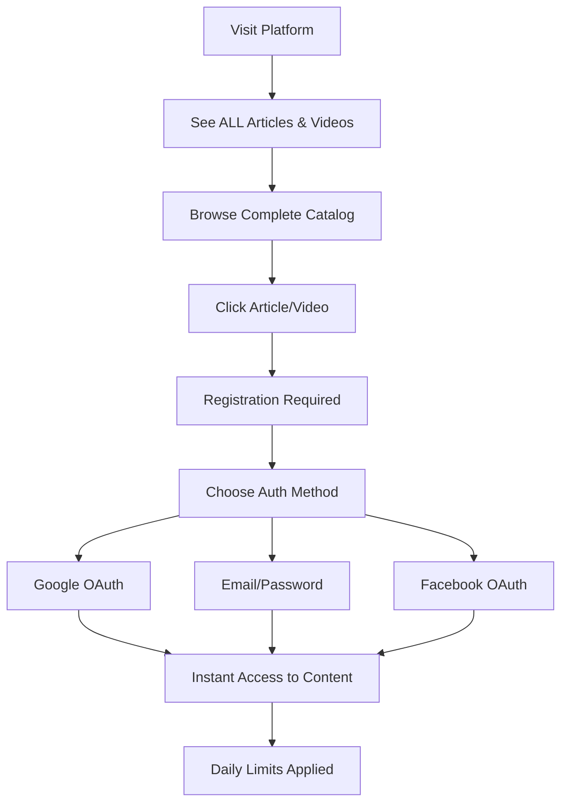
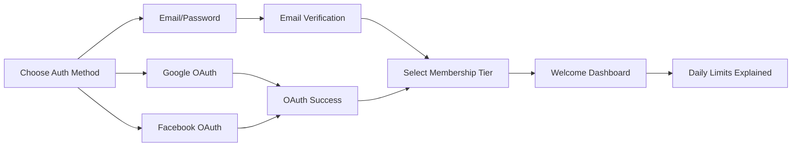
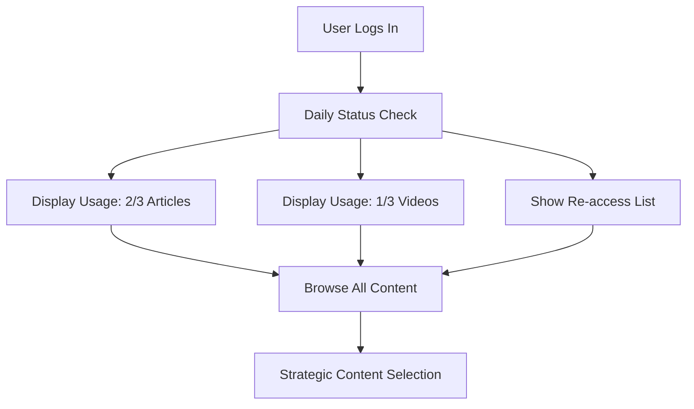
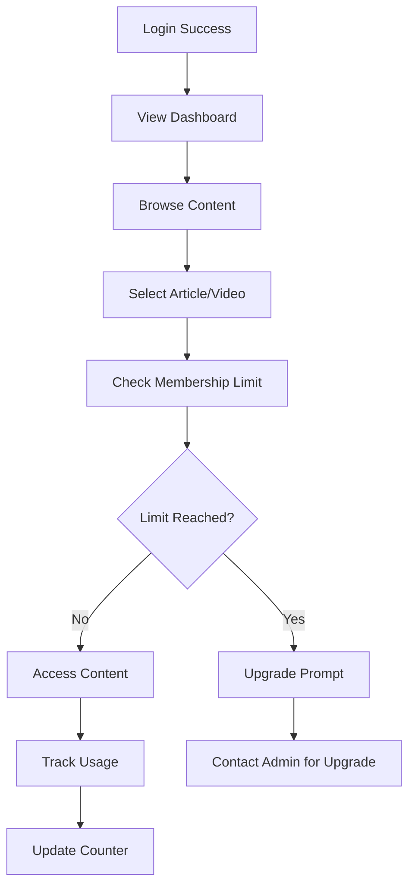
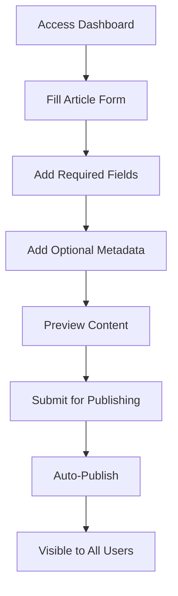
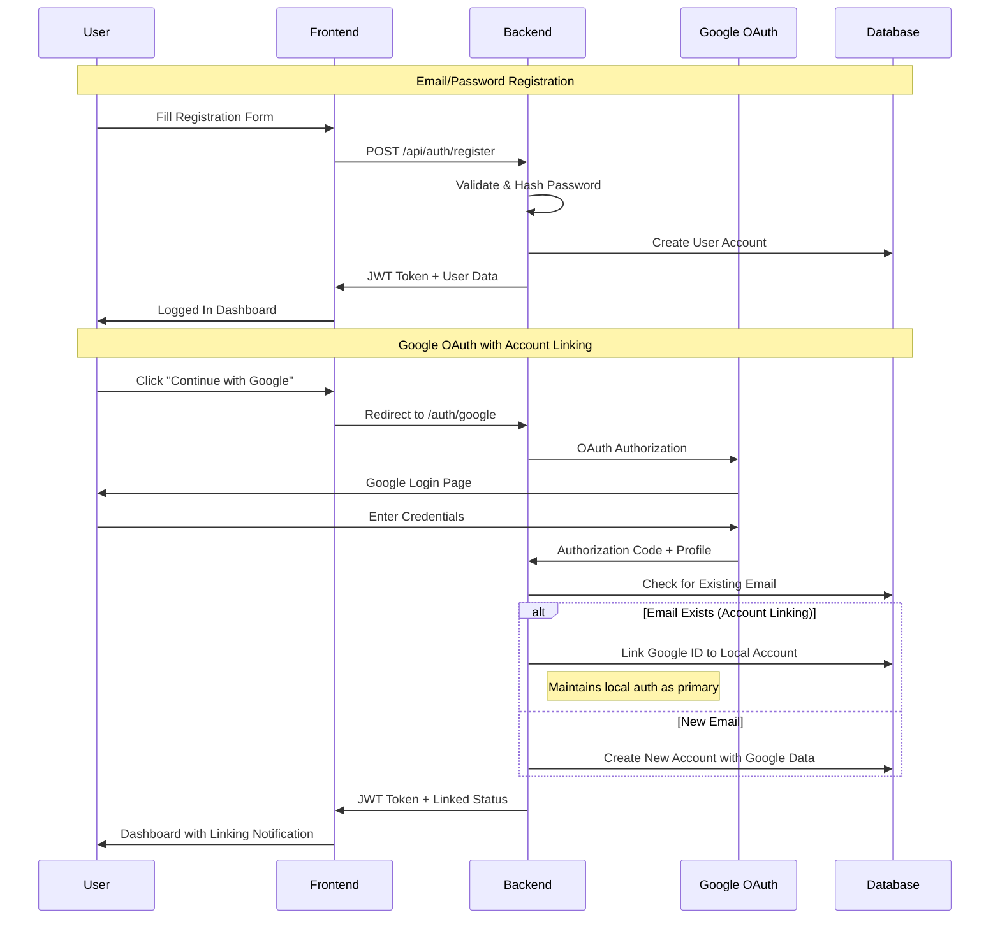
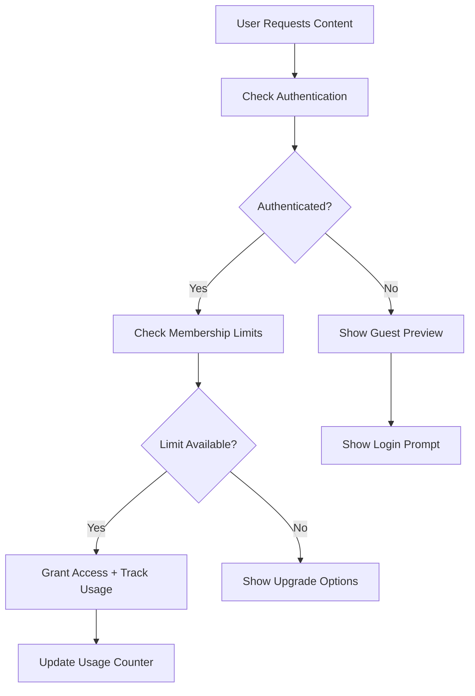
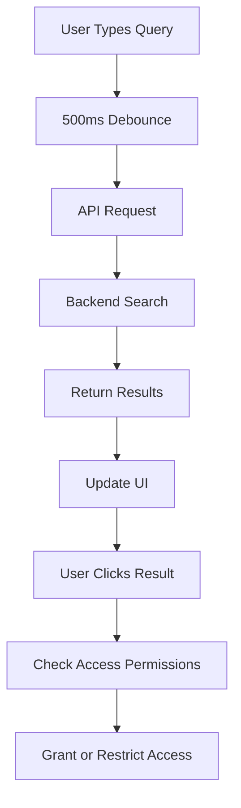

# 🚀 Complete User Journey Documentation
## Social Media Platform - Daily Content Access System

*Last Updated: June 14, 2025*

---

## 📖 Table of Contents

1. [Platform Overview](#platform-overview)
2. [Daily Content Access System](#daily-content-access-system)
3. [User Types & Roles](#user-types--roles)
4. [Guest User Journey](#guest-user-journey)
5. [Regular User Journey](#regular-user-journey)
6. [Daily Content Consumption Flow](#daily-content-consumption-flow)
7. [Editor Journey](#editor-journey)
8. [Admin Journey](#admin-journey)
9. [Technical Integration](#technical-integration)
10. [API Documentation](#api-documentation)
11. [Troubleshooting](#troubleshooting)

---

## 🎯 Platform Overview

The **Astronacci Social Media Platform** is a content management and consumption platform featuring a revolutionary **Daily Content Access System** that maximizes user engagement while managing content consumption.

### **Core Features**
- **📚 Content Types:** Articles & Videos with rich metadata
- **🔐 Authentication:** Multiple methods (Email/Password, Google OAuth, Facebook)
- **🎯 Daily Access System:** Smart daily limits with free re-access
- **👥 Role-Based Access:** User, Editor, Admin permissions
- **📊 Interactive API:** Swagger documentation with live testing
- **📱 Responsive Design:** Mobile-first Tailwind CSS interface

### **Key URLs**
- **Frontend:** http://localhost:3000
- **Backend API:** http://localhost:5001
- **API Docs:** http://localhost:5001/api-docs
- **Health Check:** http://localhost:5001/health

---

## 🎯 Daily Content Access System

### **🔄 Revolutionary Daily Limits**

The platform implements a **daily content access system** that fundamentally changes how users interact with content:

#### **Content Discovery (Unlimited)**
- ✅ **All users see ALL content** in listing pages
- ✅ **Full search and filtering** capabilities
- ✅ **Complete metadata access** (titles, excerpts, thumbnails)
- ✅ **No browsing restrictions** whatsoever

#### **Content Consumption (Daily Limited)**
- 📖 **Article Detail Access:** Counts against daily limit
- 🎥 **Video Detail Access:** Counts against daily limit
- 🔄 **Smart Re-access:** Revisiting content is FREE
- 🌙 **Midnight Reset:** Fresh limits every day

### **Membership Tiers & Daily Limits**

| Tier | Daily Articles | Daily Videos | Price | Benefits |
|------|---------------|--------------|-------|----------|
| **TYPE_A** | 3 | 3 | Free | Basic daily access |
| **TYPE_B** | 10 | 10 | $9.99/month | Enhanced daily access |
| **TYPE_C** | Unlimited | Unlimited | $19.99/month | Complete freedom |

### **Smart Access Features**
1. **📅 Daily Reset**: Fresh opportunities every day at midnight
2. **🔄 Re-access Protection**: View consumed content without penalty
3. **📊 Usage Tracking**: Real-time progress indicators
4. **🎯 Strategic Choice**: Users decide what to consume
5. **📈 Engagement Driven**: Encourages daily platform visits

---

## 👥 User Types & Roles

### **Authentication Roles**
- **🔓 Guest:** Browse ALL content listings, limited detail access
- **👤 User:** Daily content access based on membership tier
- **✏️ Editor:** Content creation + user privileges
- **� Admin:** Complete platform management

### **Authentication Methods**
- **📧 Email/Password:** Traditional secure registration
- **🔐 Google OAuth:** Seamless social login with account linking
- **📘 Facebook OAuth:** Alternative social authentication
- **🔗 Smart Linking:** Automatic account merging for existing emails

---

## 🔍 Guest User Journey

### **New Guest Experience Flow**



### **Enhanced Guest Capabilities**
✅ **Can Do:**
- **See ALL content listings** (complete catalog visibility)
- **Browse without restrictions** (search, filter, paginate)
- **View rich metadata** (titles, excerpts, thumbnails, tags)
- **Access platform navigation** and features
- **Understand membership benefits** clearly

❌ **Cannot Do:**
- Access article/video detail pages
- Consume full content
- Track daily usage
- Save content preferences

### **Conversion Strategy**
1. **Full Visibility Hook:** Users see everything available
2. **Strategic FOMO:** "Choose wisely with your daily limits"
3. **Clear Value Prop:** Immediate access after registration
4. **Multiple Entry Points:** Every piece of content is a conversion opportunity
3. **Navigation Bar:** Prominent login button
4. **Footer:** Registration benefits

---

## 👤 Regular User Journey - Daily Access System

### **🔐 Registration & Onboarding**

#### **Registration Process**


#### **Step 1: Multi-Method Registration**

**Option A: Email/Password Registration**
1. **Visit Login Page** → Click "Create Account"
2. **Complete Registration Form:**
   - Full name (required)
   - Email address (unique, validated)
   - Password (minimum 6 characters, hashed with bcrypt)
   - Membership tier selection (defaults to TYPE_A)
3. **Instant Account Creation** with JWT token
4. **Welcome Tutorial** explaining daily access system

**Option B: Google OAuth Registration**
1. **Click "Continue with Google"**
2. **Google OAuth Flow** with automatic account linking
3. **Profile Data Import** (name, email, avatar)
4. **Daily Limits Setup** with tier selection

**Option C: Facebook OAuth Registration**
1. **Click "Continue with Facebook"**
2. **Facebook OAuth Flow** with seamless integration
3. **Automatic Profile Creation**
4. **Daily Access System Introduction**

#### **Step 2: Daily Access System Onboarding**

**Welcome Tutorial Shows:**
- 🎯 **Daily Limits Concept:** "Access content strategically with daily limits"
- 🔄 **Re-access Benefits:** "Revisit content from today without using limits"
- 📅 **Reset Schedule:** "Fresh limits every day at midnight"
- 📊 **Usage Tracking:** "Monitor your daily consumption in real-time"

**Initial Dashboard Setup:**
- 📈 **Daily Counters:** 0/3 articles, 0/3 videos (TYPE_A)
- 📚 **Full Catalog Access:** Browse all content immediately
- 🎯 **Strategic Tips:** Content selection guidance
- ⏰ **Reset Timer:** Next limit refresh countdown

### **🌅 Daily User Experience**

#### **Login & Daily Status Dashboard**


**Dashboard Elements:**
- 📊 **Usage Counters:** Real-time daily consumption tracking
- 📈 **Progress Bars:** Visual representation of limit usage
- 🔄 **Re-access Panel:** Content available for free revisit
- ⏰ **Reset Timer:** "Fresh limits in 8 hours 23 minutes"
- 📱 **Mobile Optimized:** Full functionality across devices

#### **Enhanced Content Discovery (Unlimited)**
✅ **Always Available:**
- 📚 **Complete Article Library:** See every published article
- 🎥 **Full Video Catalog:** Browse all available videos
- 🔍 **Advanced Search:** Filter by tags, categories, dates, authors
- 📖 **Rich Metadata:** Titles, excerpts, thumbnails, reading time
- 📱 **Responsive Browsing:** Seamless mobile and desktop experience
   - Access video content
   - Use search functionality

### **Content Consumption Flow**



### **Daily Usage Pattern**
1. **Morning:** Check new articles
2. **Commute:** Watch videos on mobile
3. **Break Time:** Read quick articles
4. **Evening:** Deep-dive content consumption

### **Limit Management**
- **TYPE_A Users (3/3 limit):**
  - Real-time counter display
  - Warning at 2/3 usage
  - Upgrade suggestions at limit
  - Monthly reset notification

### **Upgrade Request Process**
1. **Hit Content Limit** → See upgrade prompt
2. **Contact Admin** via platform
3. **Admin Reviews** upgrade request
4. **Tier Change** (TYPE_A → TYPE_B → TYPE_C)
5. **Immediate Access** to expanded content

---

## ✏️ Editor Journey

### **Editor Onboarding**
1. **Start as Regular User** (standard registration)
2. **Request Editor Access** from admin
3. **Admin Promotes Role** (user → editor)
4. **Access CMS Features** immediately

### **Content Creation Workflow**

#### **Dashboard Access**
- **URL:** http://localhost:3000/dashboard
- **New Interface:** Complete article creation form
- **Permissions Check:** Automatic role verification

#### **Article Creation Process**



### **Article Form Fields**

#### **Required Fields:**
- **Title:** SEO-optimized headline
- **Content:** Full article body (Markdown supported)

#### **Optional Fields:**
- **Excerpt:** Summary for listings
- **Category:** Content classification
- **Tags:** Comma-separated keywords
- **Featured Image:** Header image URL
- **Publication Status:** Draft/Published

### **Content Management Features**
1. **Create Articles** via web form
2. **Edit Existing Content** (own articles)
3. **Bulk Operations** (coming soon)
4. **Content Analytics** (view only)

### **Editor Daily Workflow**
1. **Login** to dashboard
2. **Check Content Calendar** (planned feature)
3. **Write New Articles** using web form
4. **Review Published Content**
5. **Monitor Engagement** metrics

---

## 👑 Admin Journey

### **Admin Responsibilities**
- **User Management:** Role assignments and upgrades
- **Content Oversight:** Full edit/delete permissions
- **Platform Administration:** System monitoring
- **API Access:** Full backend integration

### **Admin Dashboard Features**

#### **User Management Panel**
- **View All Users** with filtering
- **Role Management:** Promote user → editor → admin
- **Membership Control:** Upgrade user tiers
- **User Statistics:** Registration trends, engagement

#### **Content Management**
- **Full CRUD Access:** Create, Read, Update, Delete
- **Content Moderation:** Review flagged content
- **Bulk Operations:** Mass updates and deletions
- **Analytics Dashboard:** Content performance metrics

### **Admin Workflow Examples**

#### **Promoting a User to Editor**
1. **Access User Management** via dashboard
2. **Search User** by email/name
3. **Click "Change Role"** button
4. **Select "Editor"** from dropdown
5. **Confirm Changes** → User gets immediate access

#### **Handling Membership Upgrades**
1. **Review Upgrade Requests** in admin panel
2. **Verify User Activity** and engagement
3. **Approve Upgrade:** TYPE_A → TYPE_B → TYPE_C
4. **Send Notification** to user
5. **Monitor Usage** post-upgrade

### **API Management**
- **Swagger Dashboard:** http://localhost:5001/api-docs
- **Direct API Access:** All endpoints with admin privileges
- **System Monitoring:** Server health and performance
- **Database Management:** User and content operations

---

## 🔧 Technical Integration

### **Authentication Flow**



### **Content Access Control**



### **Role-Based Access Control (RBAC)**

| Feature | Guest | User | Editor | Admin |
|---------|-------|------|--------|-------|
| Browse Content | ✅ | ✅ | ✅ | ✅ |
| Read Articles | ❌ | ✅ (Limited) | ✅ | ✅ |
| Watch Videos | ❌ | ✅ (Limited) | ✅ | ✅ |
| Create Content | ❌ | ❌ | ✅ | ✅ |
| Edit Content | ❌ | ❌ | ✅ (Own) | ✅ (All) |
| Delete Content | ❌ | ❌ | ❌ | ✅ |
| User Management | ❌ | ❌ | ❌ | ✅ |
| System Settings | ❌ | ❌ | ❌ | ✅ |

---

## 📚 API Documentation

### **Authentication Endpoints**
```http
# Email/Password Authentication
POST /api/auth/register     # User registration with email/password
POST /api/auth/login        # User login with email/password

# OAuth Authentication
GET /api/auth/google        # Google OAuth initiation
GET /api/auth/google/callback # Google OAuth callback with account linking
GET /api/auth/facebook      # Facebook OAuth initiation  
GET /api/auth/facebook/callback # Facebook OAuth callback

# User Profile Management
GET /api/users/me          # Get current user profile
PUT /api/users/me          # Update user profile
POST /api/auth/logout      # Logout user (clears session)
```

### **Public Endpoints**
```http
GET /api/articles          # Browse articles (paginated)
GET /api/articles/{id}     # Get single article
GET /api/videos           # Browse videos (paginated)
GET /api/videos/{id}      # Get single video
GET /health               # System health check
```

### **Authenticated Endpoints**
```http
# User Management
GET /api/users/me         # Get current user profile
PUT /api/users/me         # Update user profile

# Content Access (with limits)
POST /api/articles/{id}/read    # Track article read
POST /api/videos/{id}/watch     # Track video watch
```

### **Editor Endpoints**
```http
POST /api/articles        # Create new article
PUT /api/articles/{id}    # Update own article
GET /api/articles/drafts  # Get draft articles
```

### **Admin Endpoints**
```http
# User Management
GET /api/users            # List all users
PUT /api/users/{id}/role  # Change user role
PUT /api/users/{id}/tier  # Update membership tier
DELETE /api/users/{id}    # Delete user account

# Content Management
DELETE /api/articles/{id} # Delete any article
PUT /api/articles/{id}    # Edit any article
GET /api/analytics        # Platform analytics
```

### **Authentication Headers**
```http
Authorization: Bearer {JWT_TOKEN}
Content-Type: application/json
```

---

## 🛠️ User Journey Testing Scenarios

### **Scenario 1: New User Registration & Onboarding**

**Email/Password Registration Flow:**
1. **Visit:** http://localhost:3000
2. **Browse:** Article listings as guest
3. **Try Reading:** Hit paywall after excerpt
4. **Register:** Click login → Toggle to "Create Account"
5. **Fill Form:** Name, email, password, confirm password
6. **Submit:** Instant account creation with JWT token
7. **First Login:** Access dashboard with TYPE_A membership
8. **Content Access:** Use allowance (3 articles, 3 videos)
9. **Hit Limit:** See upgrade prompt with admin contact

**Google OAuth Registration Flow:**
1. **Visit:** http://localhost:3000
2. **Quick Register:** Click "Continue with Google"
3. **OAuth Flow:** Google authentication and consent
4. **Account Creation:** Auto-populated profile from Google
5. **Dashboard Access:** Immediate TYPE_A membership
6. **Content Consumption:** Start with full allowance

**Account Linking Scenario:**
1. **Existing User:** Already has local account (test@example.com)
2. **OAuth Attempt:** Clicks "Continue with Google" with same email
3. **Automatic Linking:** System links Google profile to existing account
4. **Notification:** "Google account linked successfully"
5. **Dual Access:** Can now login via email/password OR Google OAuth

### **Scenario 2: Content Creator Journey**
1. **Register:** Via email/password or Google OAuth
2. **Build Reputation:** Engage with platform content
3. **Request Access:** Email admin for editor role promotion
4. **Get Promoted:** Admin changes role from user to editor
5. **Dashboard Access:** New CMS interface appears
6. **Create Content:** Use comprehensive article creation form
7. **Publish:** Articles go live immediately for all users
8. **Manage:** Edit, update, and track content performance

### **Scenario 3: Returning User Experience**
1. **Visit Login Page:** Choose preferred authentication method
2. **Email/Password:** Quick login with saved credentials
3. **OAuth Login:** One-click Google/Facebook authentication
4. **Session Restore:** Automatic dashboard redirect
5. **Content Resume:** Pick up where left off with usage tracking
6. **Cross-Device:** Seamless experience across devices

### **Scenario 3: Platform Administration**
1. **Admin Login:** firdausamerta@gmail.com (email/password or OAuth)
2. **User Management:** Promote users to editors, manage roles
3. **Membership Control:** Upgrade user tiers (TYPE_A → TYPE_B → TYPE_C)
4. **Content Oversight:** Review, edit, and moderate all content
5. **System Monitoring:** Check API health and user analytics
6. **Bulk Operations:** Manage multiple users and content efficiently

### **Scenario 4: Authentication Security Testing**
1. **Password Validation:** Test weak passwords (rejected)
2. **Duplicate Registration:** Try registering same email twice (blocked)
3. **Invalid Login:** Test wrong credentials (proper error handling)
4. **Account Linking:** Test OAuth with existing email (automatic linking)
5. **Session Management:** Test token expiration and refresh
6. **Cross-Browser:** Verify authentication across different browsers

---

## 🔍 Search & Discovery

### **Content Search Features**
- **Debounced Search:** 500ms delay for smooth typing
- **Real-time Results:** Updates as you type
- **Multi-field Search:** Searches title, content, tags
- **Category Filtering:** Filter by content type
- **Pagination:** Handle large result sets

### **Search Journey**


---

## 📱 Mobile Experience

### **Responsive Design**
- **Breakpoints:** Mobile, Tablet, Desktop
- **Touch Optimization:** Larger buttons, swipe gestures
- **Performance:** Optimized loading for mobile networks
- **Offline Support:** Cached content (coming soon)

### **Mobile User Flow**
1. **Home Screen:** Quick access to popular content
2. **Swipe Navigation:** Easy content browsing
3. **Touch-friendly Forms:** Easy article creation
4. **One-thumb Usage:** Optimized UI layout

---

## 🔔 Notifications & Communication

### **User Notifications**
- **Limit Warnings:** When approaching content limits
- **New Content:** Fresh articles and videos
- **Role Changes:** Promotion notifications
- **System Updates:** Platform announcements

### **Admin Communications**
- **User Requests:** Editor role applications
- **System Alerts:** Performance issues
- **Content Reports:** Moderation needs
- **Analytics Reports:** Usage statistics

---

## 📊 Analytics & Tracking

### **User Metrics**
- **Content Consumption:** Articles read, videos watched
- **Engagement Time:** Time spent on platform
- **Search Queries:** Popular content discovery
- **Conversion Rates:** Guest → User → Paid

### **Content Metrics**
- **Popular Articles:** Most read content
- **Video Engagement:** Watch time and completion
- **Search Rankings:** Content discoverability
- **User Feedback:** Engagement signals

---

## 🚨 Error Handling & Support

### **Common Error Scenarios**

#### **Authentication Errors**
- **Google OAuth Failure:** Redirect to error page with retry
- **JWT Expiration:** Auto-refresh or re-login prompt
- **Permission Denied:** Clear error message with upgrade path

#### **Content Access Errors**
- **Limit Reached:** Friendly upgrade suggestion
- **Content Not Found:** 404 with related suggestions
- **Server Issues:** Graceful degradation with retry options

### **User Support Flow**
1. **Error Occurs** → Clear error message
2. **Self-Service Options** → FAQ, troubleshooting guides
3. **Contact Support** → Admin email or form
4. **Admin Resolution** → Direct user assistance
5. **Follow-up** → Ensure issue resolved

---

## 🔮 Future Enhancements

### **Planned Features**
- **Advanced Editor:** Rich text editing with media upload
- **Content Calendar:** Editorial planning tools
- **Social Features:** Comments, likes, sharing
- **Advanced Analytics:** Detailed user insights
- **Mobile App:** Native iOS/Android applications
- **Payment Integration:** Premium membership automation
- **Content Recommendations:** AI-powered suggestions

### **User Journey Evolution**
- **Personalization:** Customized content feeds
- **Gamification:** Reading streaks, achievements
- **Community Features:** User interactions and discussions
- **Multi-language Support:** International expansion
- **Offline Mode:** Download content for offline reading

---

## ✅ Current Implementation Status

### **Completed Features** ✅
- [x] **Comprehensive Authentication System**
  - [x] Email/password registration and login with secure bcrypt hashing
  - [x] Google OAuth integration with automatic account linking
  - [x] Facebook OAuth support
  - [x] Unified login/registration interface with dynamic form switching
  - [x] JWT token authentication with configurable expiration
  - [x] Real-time form validation and comprehensive error handling
- [x] **Enhanced User Experience**
  - [x] Toggle between login and registration modes on single page
  - [x] Account linking notifications and status feedback
  - [x] Loading states and progress indicators
  - [x] Responsive design for all device types
- [x] User registration and social authentication
- [x] Role-based access control (User/Editor/Admin)
- [x] Membership tiers with content limits
- [x] Article creation and management
- [x] Interactive API documentation (Swagger)
- [x] Search functionality with debouncing
- [x] Responsive web design
- [x] Content consumption tracking
- [x] Admin user management
- [x] Real-time form validation

### **In Development** 🚧
- [ ] Video content management
- [ ] Advanced content editor with rich text editing
- [ ] User analytics dashboard with detailed metrics
- [ ] Email notifications for user actions
- [ ] Content moderation tools and reporting
- [ ] Advanced search filters and sorting options

### **Future Roadmap** 📋
- [ ] Mobile application (React Native)
- [ ] Payment processing for automatic tier upgrades
- [ ] Advanced search filters and content recommendations
- [ ] Social media integration and sharing
- [ ] AI-powered content suggestions
- [ ] Multi-language support and internationalization
- [ ] Progressive Web App (PWA) capabilities
- [ ] Real-time notifications and websockets

---

## 🎯 Key Success Metrics

### **User Engagement**
- **Daily Active Users:** Target 1000+ DAU
- **Authentication Conversion:** 30+ % guest to registered user conversion
- **Account Linking:** 80+ % OAuth users link to existing accounts successfully
- **Session Duration:** 15+ minutes average browsing time
- **Return Rate:** 70+ % weekly return for registered users

### **Authentication Performance**
- **Registration Success:** 95+ % successful registrations
- **Login Speed:** <2s authentication response time
- **OAuth Flow:** <10s complete Google/Facebook login process
- **Account Linking:** 100% automatic linking for matching emails
- **Security Compliance:** 0 password breaches, secure bcrypt hashing

### **Content Performance**
- **Article Creation:** 10+ new articles weekly
- **Content Engagement:** 85+ % article completion rate
- **Search Success:** 90+ % query satisfaction
- **Load Performance:** <2s page load times
- **Mobile Usage:** 60+ % traffic from mobile devices

### **Business Metrics**
- **User Conversion:** 20+ % guest to user registration
- **Tier Upgrades:** 15+ % users upgrade membership tiers
- **Content Consumption:** Users hit 80+ % of tier limits monthly
- **Platform Growth:** 25+ % monthly user growth
- **OAuth Adoption:** 60+ % users prefer social login methods

---

*This user journey documentation provides a comprehensive guide for all platform stakeholders, from end users to administrators and developers. Regular updates ensure accuracy as the platform evolves.*

**Last Updated:** June 14, 2025  
**Version:** 2.0  
**Next Review:** June 28, 2025
