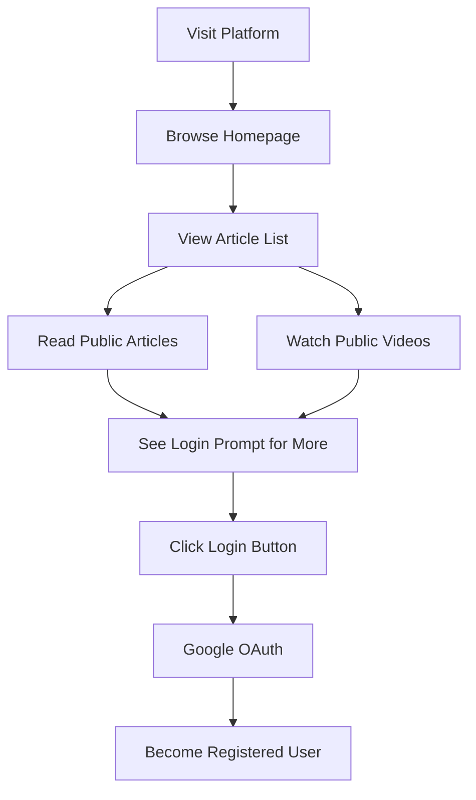
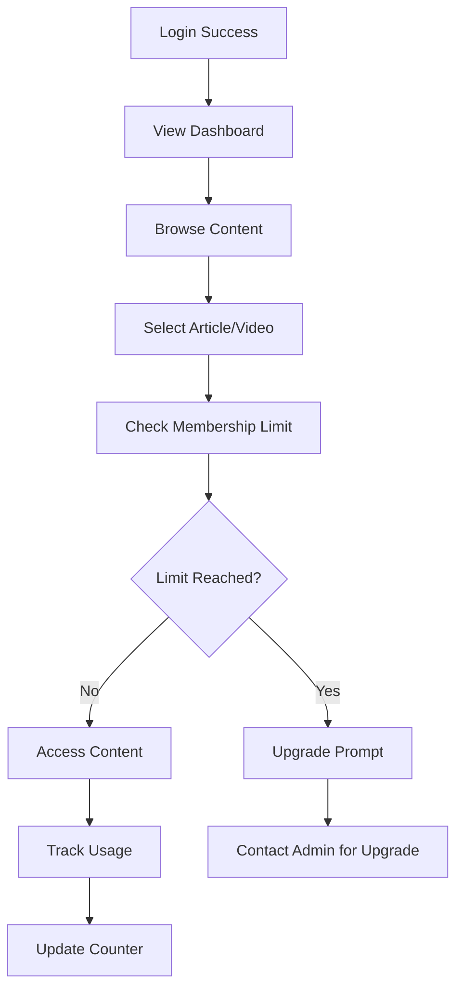
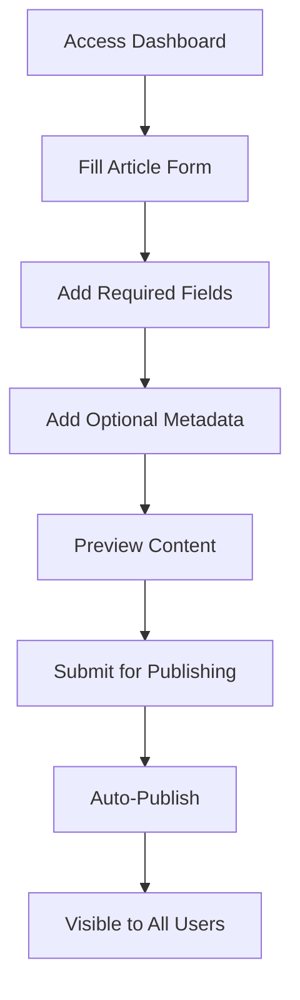
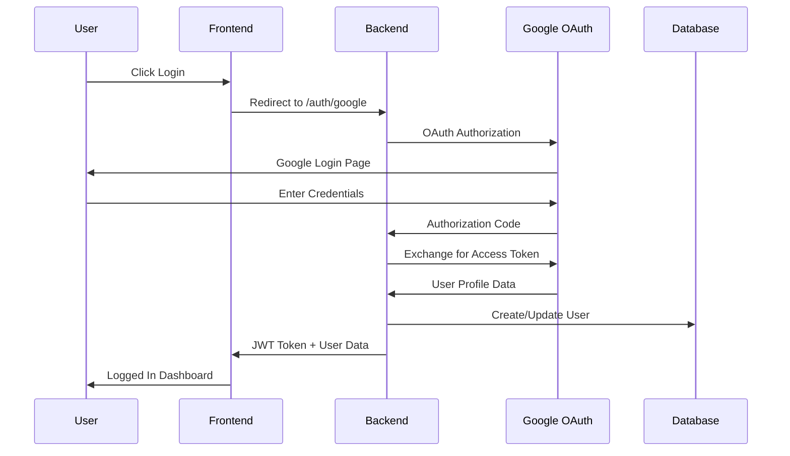
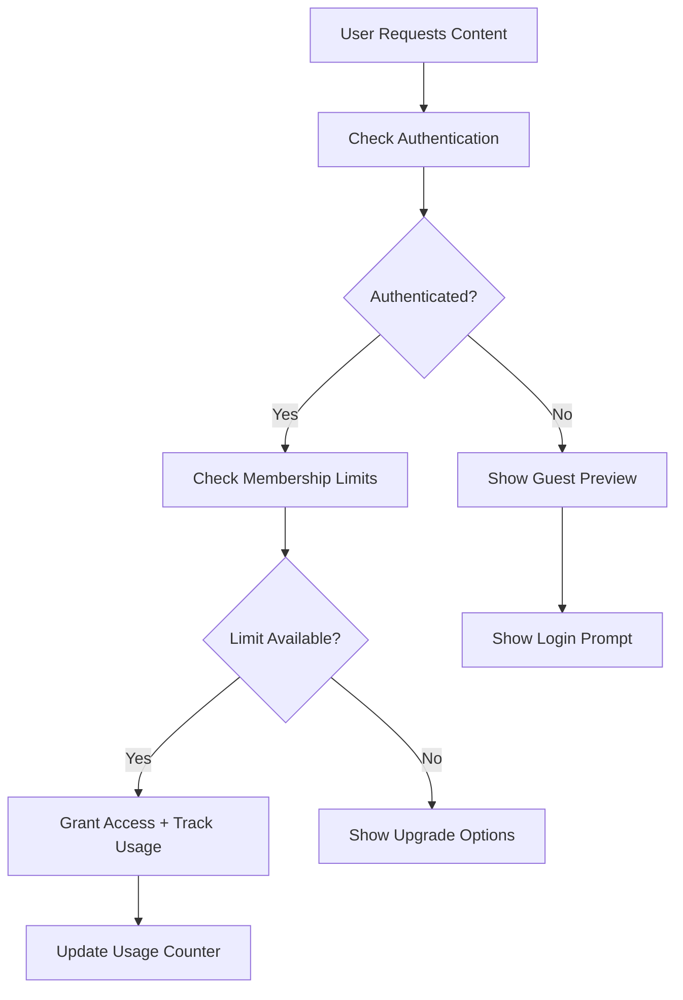
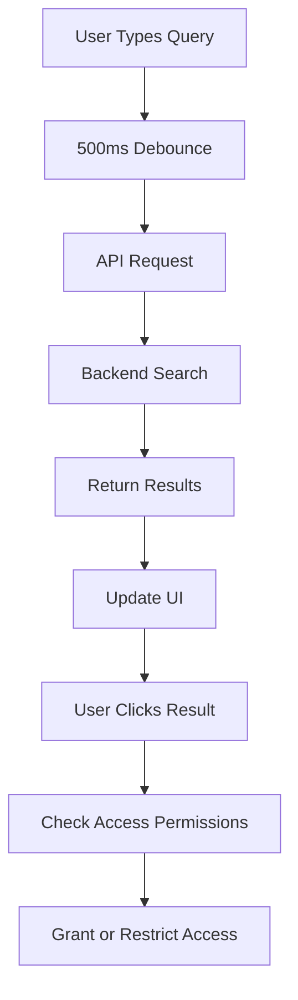

# 🚀 Complete User Journey Documentation
## Social Media Platform - Astronacci Assessment

*Last Updated: June 14, 2025*

---

## 📖 Table of Contents

1. [Platform Overview](#platform-overview)
2. [User Types & Roles](#user-types--roles)
3. [Guest User Journey](#guest-user-journey)
4. [Regular User Journey](#regular-user-journey)
5. [Editor Journey](#editor-journey)
6. [Admin Journey](#admin-journey)
7. [Technical Integration](#technical-integration)
8. [API Documentation](#api-documentation)
9. [Troubleshooting](#troubleshooting)

---

## 🎯 Platform Overview

The **Astronacci Social Media Platform** is a content management and consumption platform featuring:

- **Content Types:** Articles & Videos
- **Authentication:** Google OAuth integration
- **Membership Tiers:** TYPE_A, TYPE_B, TYPE_C with content limits
- **Role-Based Access:** User, Editor, Admin permissions
- **Interactive API:** Swagger documentation with live testing

### **Key URLs**
- **Frontend:** http://localhost:3000
- **Backend API:** http://localhost:5001
- **API Docs:** http://localhost:5001/api-docs
- **Health Check:** http://localhost:5001/health

---

## 👥 User Types & Roles

### **Authentication Roles**
- **🔓 Guest:** Browse public content only
- **👤 User:** Registered members with content consumption limits
- **✏️ Editor:** Can create and edit content
- **👑 Admin:** Full platform management access

### **Membership Tiers**
- **TYPE_A:** 3 articles, 3 videos
- **TYPE_B:** 10 articles, 10 videos  
- **TYPE_C:** Unlimited access

---

## 🔍 Guest User Journey

### **Entry Points**
1. **Direct URL Access:** http://localhost:3000
2. **Search Engine:** Landing on article pages
3. **Social Media:** Shared content links

### **Guest Experience Flow**



### **Available Actions**
✅ **Can Do:**
- Browse article listings
- Read article excerpts
- View public video previews
- Access platform navigation
- See registration prompts

❌ **Cannot Do:**
- Read full articles
- Watch complete videos
- Access dashboard
- Create content
- Save favorites

### **Conversion Touchpoints**
1. **Article Paywall:** After reading excerpt
2. **Video Preview End:** Call-to-action to register
3. **Navigation Bar:** Prominent login button
4. **Footer:** Registration benefits

---

## 👤 Regular User Journey

### **Onboarding Process**

#### **Step 1: Registration**
1. **Click "Login"** on any page
2. **Google OAuth Flow:**
   ```
   Platform → Google → Authorization → Redirect → Profile Creation
   ```
3. **Profile Setup:**
   - Auto-populated from Google (name, email, avatar)
   - Default membership: TYPE_A (3 articles, 3 videos)
   - Default role: user

#### **Step 2: First Session**
1. **Welcome Dashboard** shows:
   - Membership tier (TYPE_A)
   - Content limits (3/3 articles, 3/3 videos)
   - Personalized recommendations

2. **Platform Exploration:**
   - Browse full article library
   - Access video content
   - Use search functionality

### **Content Consumption Flow**



### **Daily Usage Pattern**
1. **Morning:** Check new articles
2. **Commute:** Watch videos on mobile
3. **Break Time:** Read quick articles
4. **Evening:** Deep-dive content consumption

### **Limit Management**
- **TYPE_A Users (3/3 limit):**
  - Real-time counter display
  - Warning at 2/3 usage
  - Upgrade suggestions at limit
  - Monthly reset notification

### **Upgrade Request Process**
1. **Hit Content Limit** → See upgrade prompt
2. **Contact Admin** via platform
3. **Admin Reviews** upgrade request
4. **Tier Change** (TYPE_A → TYPE_B → TYPE_C)
5. **Immediate Access** to expanded content

---

## ✏️ Editor Journey

### **Editor Onboarding**
1. **Start as Regular User** (standard registration)
2. **Request Editor Access** from admin
3. **Admin Promotes Role** (user → editor)
4. **Access CMS Features** immediately

### **Content Creation Workflow**

#### **Dashboard Access**
- **URL:** http://localhost:3000/dashboard
- **New Interface:** Complete article creation form
- **Permissions Check:** Automatic role verification

#### **Article Creation Process**



### **Article Form Fields**

#### **Required Fields:**
- **Title:** SEO-optimized headline
- **Content:** Full article body (Markdown supported)

#### **Optional Fields:**
- **Excerpt:** Summary for listings
- **Category:** Content classification
- **Tags:** Comma-separated keywords
- **Featured Image:** Header image URL
- **Publication Status:** Draft/Published

### **Content Management Features**
1. **Create Articles** via web form
2. **Edit Existing Content** (own articles)
3. **Bulk Operations** (coming soon)
4. **Content Analytics** (view only)

### **Editor Daily Workflow**
1. **Login** to dashboard
2. **Check Content Calendar** (planned feature)
3. **Write New Articles** using web form
4. **Review Published Content**
5. **Monitor Engagement** metrics

---

## 👑 Admin Journey

### **Admin Responsibilities**
- **User Management:** Role assignments and upgrades
- **Content Oversight:** Full edit/delete permissions
- **Platform Administration:** System monitoring
- **API Access:** Full backend integration

### **Admin Dashboard Features**

#### **User Management Panel**
- **View All Users** with filtering
- **Role Management:** Promote user → editor → admin
- **Membership Control:** Upgrade user tiers
- **User Statistics:** Registration trends, engagement

#### **Content Management**
- **Full CRUD Access:** Create, Read, Update, Delete
- **Content Moderation:** Review flagged content
- **Bulk Operations:** Mass updates and deletions
- **Analytics Dashboard:** Content performance metrics

### **Admin Workflow Examples**

#### **Promoting a User to Editor**
1. **Access User Management** via dashboard
2. **Search User** by email/name
3. **Click "Change Role"** button
4. **Select "Editor"** from dropdown
5. **Confirm Changes** → User gets immediate access

#### **Handling Membership Upgrades**
1. **Review Upgrade Requests** in admin panel
2. **Verify User Activity** and engagement
3. **Approve Upgrade:** TYPE_A → TYPE_B → TYPE_C
4. **Send Notification** to user
5. **Monitor Usage** post-upgrade

### **API Management**
- **Swagger Dashboard:** http://localhost:5001/api-docs
- **Direct API Access:** All endpoints with admin privileges
- **System Monitoring:** Server health and performance
- **Database Management:** User and content operations

---

## 🔧 Technical Integration

### **Authentication Flow**



### **Content Access Control**



### **Role-Based Access Control (RBAC)**

| Feature | Guest | User | Editor | Admin |
|---------|-------|------|--------|-------|
| Browse Content | ✅ | ✅ | ✅ | ✅ |
| Read Articles | ❌ | ✅ (Limited) | ✅ | ✅ |
| Watch Videos | ❌ | ✅ (Limited) | ✅ | ✅ |
| Create Content | ❌ | ❌ | ✅ | ✅ |
| Edit Content | ❌ | ❌ | ✅ (Own) | ✅ (All) |
| Delete Content | ❌ | ❌ | ❌ | ✅ |
| User Management | ❌ | ❌ | ❌ | ✅ |
| System Settings | ❌ | ❌ | ❌ | ✅ |

---

## 📚 API Documentation

### **Public Endpoints**
```http
GET /api/articles          # Browse articles (paginated)
GET /api/articles/{id}     # Get single article
GET /api/videos           # Browse videos (paginated)
GET /api/videos/{id}      # Get single video
GET /health               # System health check
```

### **Authenticated Endpoints**
```http
# User Management
GET /api/users/me         # Get current user profile
PUT /api/users/me         # Update user profile

# Content Access (with limits)
POST /api/articles/{id}/read    # Track article read
POST /api/videos/{id}/watch     # Track video watch
```

### **Editor Endpoints**
```http
POST /api/articles        # Create new article
PUT /api/articles/{id}    # Update own article
GET /api/articles/drafts  # Get draft articles
```

### **Admin Endpoints**
```http
# User Management
GET /api/users            # List all users
PUT /api/users/{id}/role  # Change user role
PUT /api/users/{id}/tier  # Update membership tier
DELETE /api/users/{id}    # Delete user account

# Content Management
DELETE /api/articles/{id} # Delete any article
PUT /api/articles/{id}    # Edit any article
GET /api/analytics        # Platform analytics
```

### **Authentication Headers**
```http
Authorization: Bearer {JWT_TOKEN}
Content-Type: application/json
```

---

## 🛠️ User Journey Testing Scenarios

### **Scenario 1: New User Onboarding**
1. **Visit:** http://localhost:3000
2. **Browse:** Article listings as guest
3. **Try Reading:** Hit paywall after excerpt
4. **Register:** Click login → Google OAuth
5. **First Content:** Use TYPE_A allowance (3 articles)
6. **Hit Limit:** See upgrade prompt
7. **Contact Admin:** Request tier upgrade

### **Scenario 2: Content Creator Journey**
1. **Register:** As regular user
2. **Request Access:** Email admin for editor role
3. **Get Promoted:** Admin changes role to editor
4. **Create Content:** Use dashboard form
5. **Publish:** Article goes live immediately
6. **Manage:** Edit and update content

### **Scenario 3: Platform Administration**
1. **Admin Login:** firdausamerta@gmail.com
2. **User Management:** Promote users to editors
3. **Content Oversight:** Review and moderate
4. **System Monitoring:** Check API health
5. **Bulk Operations:** Manage multiple users

---

## 🔍 Search & Discovery

### **Content Search Features**
- **Debounced Search:** 500ms delay for smooth typing
- **Real-time Results:** Updates as you type
- **Multi-field Search:** Searches title, content, tags
- **Category Filtering:** Filter by content type
- **Pagination:** Handle large result sets

### **Search Journey**


---

## 📱 Mobile Experience

### **Responsive Design**
- **Breakpoints:** Mobile, Tablet, Desktop
- **Touch Optimization:** Larger buttons, swipe gestures
- **Performance:** Optimized loading for mobile networks
- **Offline Support:** Cached content (coming soon)

### **Mobile User Flow**
1. **Home Screen:** Quick access to popular content
2. **Swipe Navigation:** Easy content browsing
3. **Touch-friendly Forms:** Easy article creation
4. **One-thumb Usage:** Optimized UI layout

---

## 🔔 Notifications & Communication

### **User Notifications**
- **Limit Warnings:** When approaching content limits
- **New Content:** Fresh articles and videos
- **Role Changes:** Promotion notifications
- **System Updates:** Platform announcements

### **Admin Communications**
- **User Requests:** Editor role applications
- **System Alerts:** Performance issues
- **Content Reports:** Moderation needs
- **Analytics Reports:** Usage statistics

---

## 📊 Analytics & Tracking

### **User Metrics**
- **Content Consumption:** Articles read, videos watched
- **Engagement Time:** Time spent on platform
- **Search Queries:** Popular content discovery
- **Conversion Rates:** Guest → User → Paid

### **Content Metrics**
- **Popular Articles:** Most read content
- **Video Engagement:** Watch time and completion
- **Search Rankings:** Content discoverability
- **User Feedback:** Engagement signals

---

## 🚨 Error Handling & Support

### **Common Error Scenarios**

#### **Authentication Errors**
- **Google OAuth Failure:** Redirect to error page with retry
- **JWT Expiration:** Auto-refresh or re-login prompt
- **Permission Denied:** Clear error message with upgrade path

#### **Content Access Errors**
- **Limit Reached:** Friendly upgrade suggestion
- **Content Not Found:** 404 with related suggestions
- **Server Issues:** Graceful degradation with retry options

### **User Support Flow**
1. **Error Occurs** → Clear error message
2. **Self-Service Options** → FAQ, troubleshooting guides
3. **Contact Support** → Admin email or form
4. **Admin Resolution** → Direct user assistance
5. **Follow-up** → Ensure issue resolved

---

## 🔮 Future Enhancements

### **Planned Features**
- **Advanced Editor:** Rich text editing with media upload
- **Content Calendar:** Editorial planning tools
- **Social Features:** Comments, likes, sharing
- **Advanced Analytics:** Detailed user insights
- **Mobile App:** Native iOS/Android applications
- **Payment Integration:** Premium membership automation
- **Content Recommendations:** AI-powered suggestions

### **User Journey Evolution**
- **Personalization:** Customized content feeds
- **Gamification:** Reading streaks, achievements
- **Community Features:** User interactions and discussions
- **Multi-language Support:** International expansion
- **Offline Mode:** Download content for offline reading

---

## ✅ Current Implementation Status

### **Completed Features** ✅
- [x] User registration and Google OAuth
- [x] Role-based access control (User/Editor/Admin)
- [x] Membership tiers with content limits
- [x] Article creation and management
- [x] Interactive API documentation (Swagger)
- [x] Search functionality with debouncing
- [x] Responsive web design
- [x] Content consumption tracking
- [x] Admin user management
- [x] Real-time form validation

### **In Development** 🚧
- [ ] Video content management
- [ ] Advanced content editor
- [ ] User analytics dashboard
- [ ] Email notifications
- [ ] Content moderation tools

### **Future Roadmap** 📋
- [ ] Mobile application
- [ ] Payment processing
- [ ] Advanced search filters
- [ ] Social media integration
- [ ] Content recommendations
- [ ] Multi-language support

---

## 🎯 Key Success Metrics

### **User Engagement**
- **Daily Active Users:** Target 1000+ DAU
- **Content Consumption:** Average 5+ articles per user
- **Session Duration:** 15+ minutes average
- **Return Rate:** 70+ % weekly return

### **Content Performance**
- **Article Creation:** 10+ new articles weekly
- **Video Uploads:** 5+ new videos weekly
- **Search Success:** 90+ % query satisfaction
- **Load Performance:** <2s page load times

### **Business Metrics**
- **User Conversion:** 20+ % guest to user
- **Tier Upgrades:** 15+ % users upgrade tiers
- **Content Engagement:** 85+ % article completion
- **Platform Growth:** 25+ % monthly user growth

---

*This user journey documentation provides a comprehensive guide for all platform stakeholders, from end users to administrators and developers. Regular updates ensure accuracy as the platform evolves.*

**Last Updated:** June 14, 2025  
**Version:** 2.0  
**Next Review:** June 28, 2025
